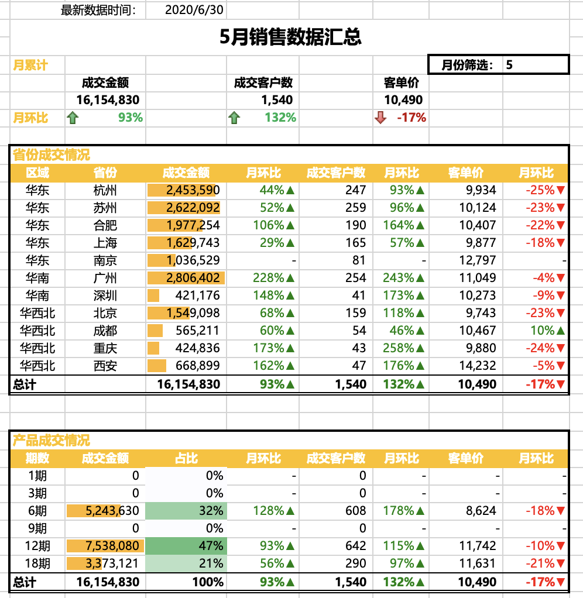
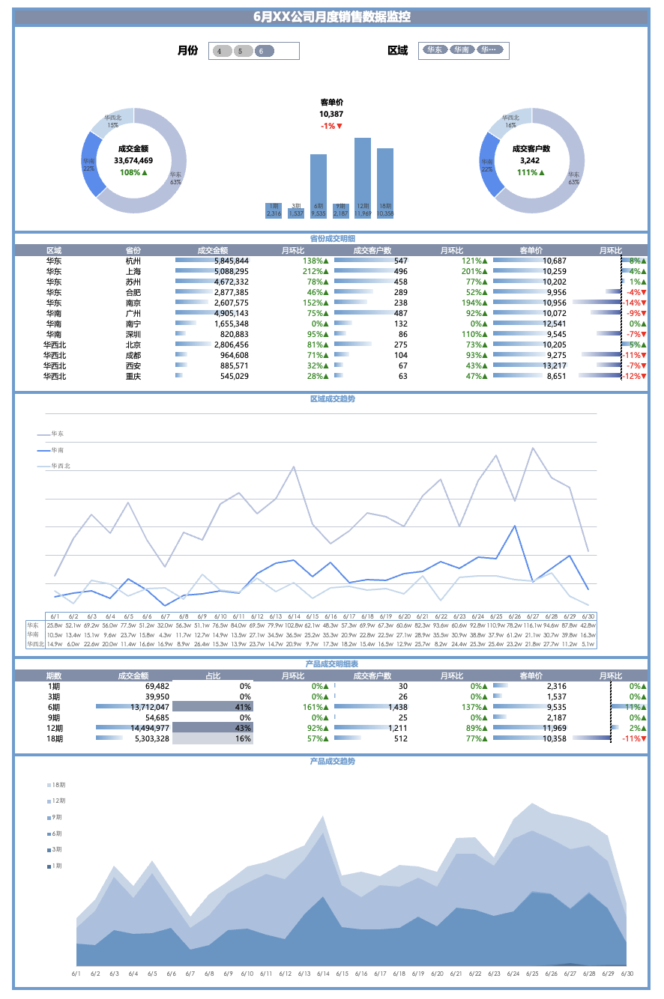

# 吴康 · 数据分析作品集

## 项目 1：销售数据可视化分析

项目介绍：本项目基于Excel构建的销售数据监控与分析系统，通过汇总表与交互式仪表盘，直观展示2020年4-6月销售数据的核心指标（成交金额、客户数、客单价）及区域/产品维度的表现，为业务决策提供数据支持。系统支持多维度筛选（月份、区域），通过可视化图表快速洞察销售趋势与异常点。

构建了一个动态销售数据汇总表，通过Excel函数和条件格式实现销售数据的自动化汇总与可视化分析，为管理层提供月度销售业绩的快速洞察。

业务价值：
快速识别各区域销售增长点和问题区域
实时监控产品销售表现，优化库存策略
为销售策略调整提供数据支持

设计了一个交互式销售数据监控仪表盘，整合多维度销售指标，通过可视化图表实时展示公司销售状况，支持多维度筛选和趋势分析。

业务价值：
实时监控销售业绩，及时发现异常
支持多维度业务分析，为决策提供全面视角
提升数据汇报的专业性和效率

---

## 项目 2：某连锁超市销售与库存优化

**背景**：超市提供 3 个月销售流水，希望优化库存结构，减少滞销品。  
**数据**：27,000 笔交易，包含商品分类、销量、库存、补货周期。  
**工具**：Python（Pandas, Seaborn）、Tableau

**分析过程：**
- 利用 `ABC 分析法` 将商品按销售额分为 A、B、C 三类
- 交叉分析库存天数，发现 C 类商品库存天数高达 48 天（远高于 A 类的 6 天）
- 用 `Seaborn` 绘制库存天数分布箱线图，识别出 12 个严重滞销单品

**关键图表：**
  
*图：各类商品平均库存天数对比，C类严重积压*

  
*图：滞销单品库存天数及占总库存成本比例*

**分析结论与建议：**
- 建议暂停 12 个滞销单品采购，设置库存告警线
- 引入“月均销量 < 5 且库存 > 30”的动态淘汰机制

[📊 交互式 Tableau 看板](https://public.tableau.com/你的用户名/retail)

---

## 项目 3：某健身 App 用户留存分析

**背景**：App 新用户次日留存率仅 21%，想通过行为数据定位流失点。  
**数据**：2,000 名用户首月行为日志（脱敏），含启动、课程浏览、社区互动。  
**工具**：Python、Pandas、Matplotlib

**分析过程：**
- 构建用户首月活跃天数热力图，发现第 4 天流失陡增
- 对比留存与流失用户在关键行为上的差异：留存用户平均添加 3.2 个课程，流失用户仅 0.8
- 制作留存曲线并进行群组分析

**关键图表：**
  
*图：不同注册周用户留存曲线，首周流失最严重*

  
*图：留存与流失用户前 3 天平均行为次数对比*

**分析结论与建议：**
- 引导新用户在前 3 天内完成“添加 3 个课程”任务，可有效提升留存
- 建议在第 3 天推送个性化课表，降低第 4 天流失

[📁 项目代码与数据说明](https://github.com/你的用户名/fitness-app)

